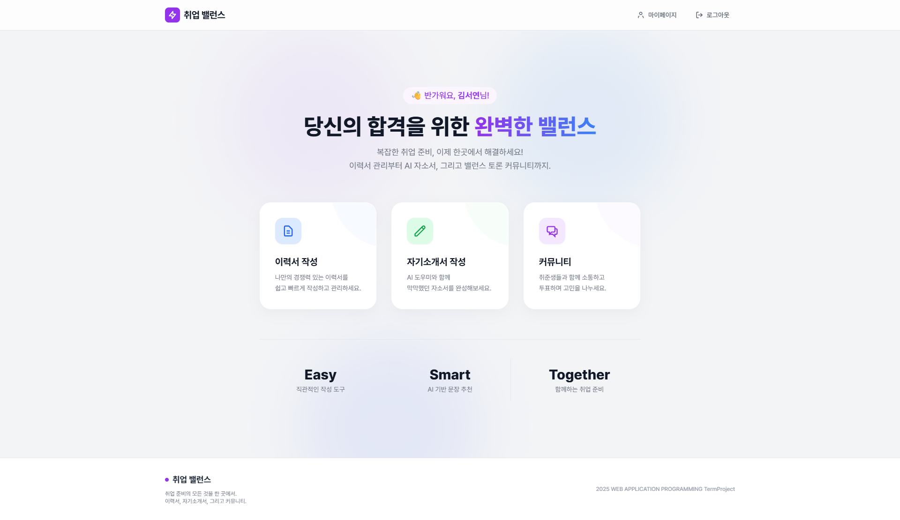
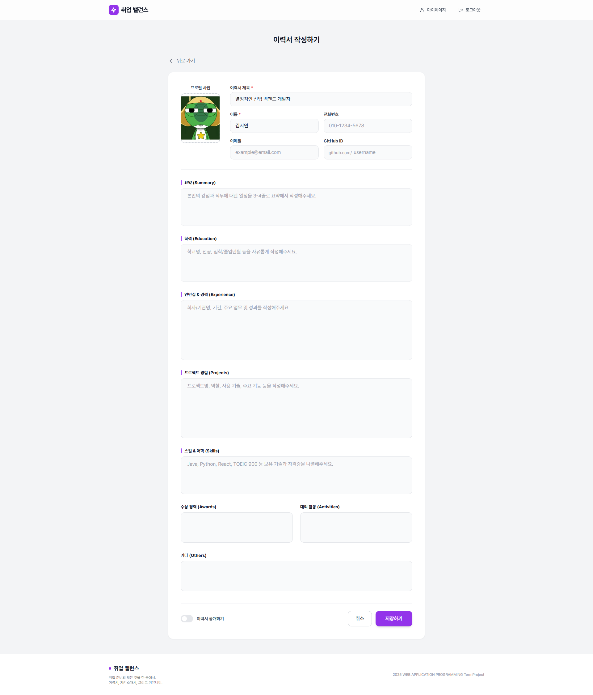
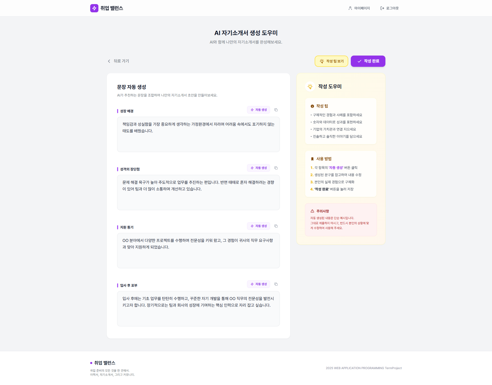
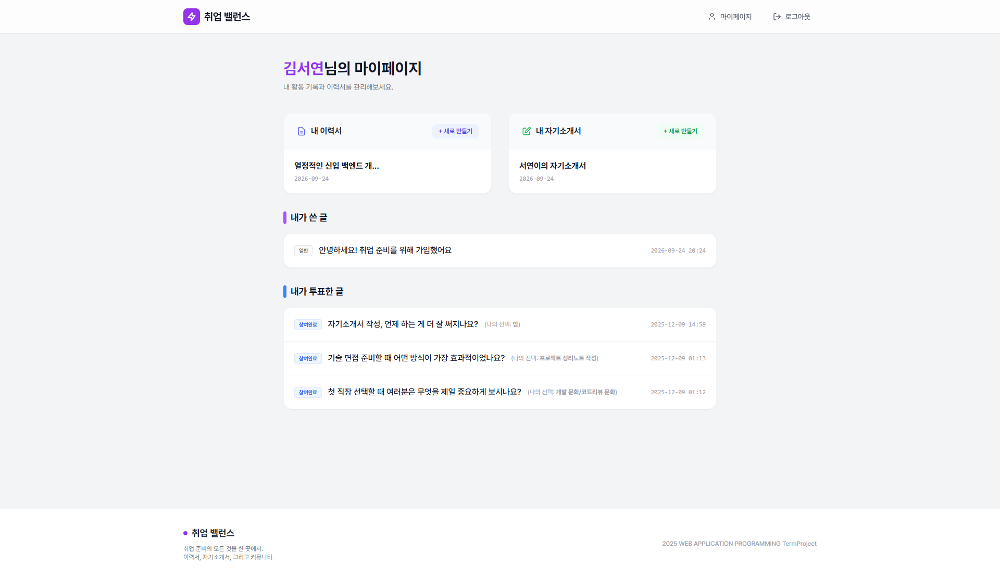
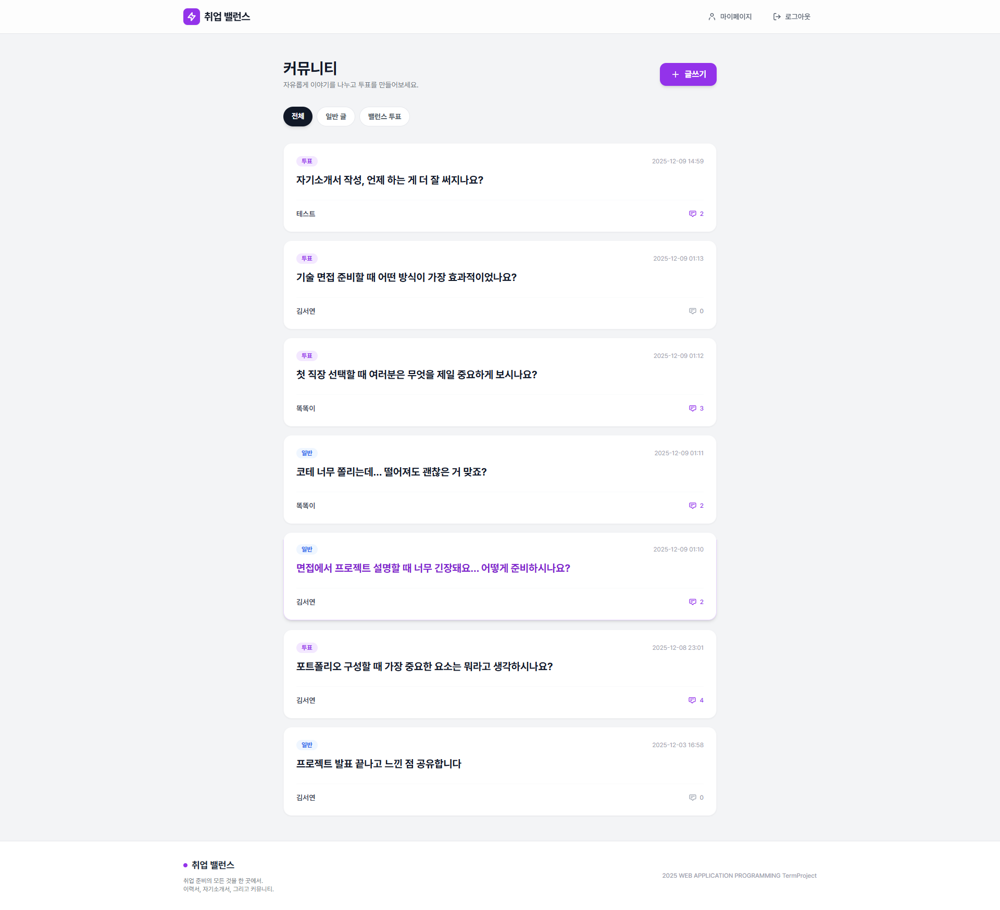
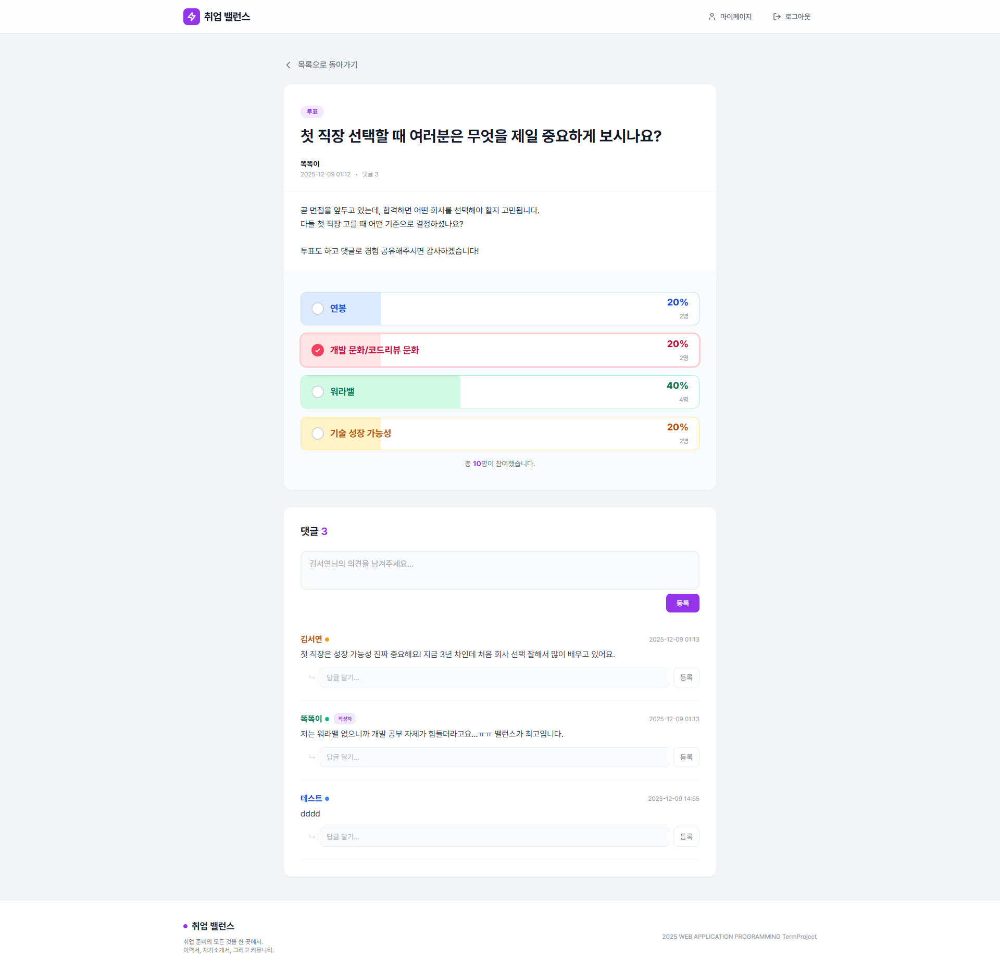

# 취업 밸런스 (Career Balance)

취업 준비 과정에서 분산되기 쉬운 이력서, 자기소개서, 포트폴리오와 커뮤니티 활동을 한 곳에서 관리할 수 있도록 만든 웹 플랫폼입니다.

2025학년도 2학기 웹응용프로그래밍 Term Project로 진행한 2인 팀 프로젝트입니다.

---

## 주요 화면

### 홈

<p align="center">
  
</p>

취업 준비에 필요한 이력서 작성, 자기소개서 작성, 커뮤니티 기능으로 바로 이동할 수 있는 메인 화면입니다.

### 문서 작성 및 관리

<table>
  <tr>
    <td width="50%" align="center">
      
    </td>
    <td width="50%" align="center">
      
    </td>
  </tr>
  <tr>
    <td align="center">이력서 작성</td>
    <td align="center">AI 자기소개서 생성 도우미</td>
  </tr>
</table>

사용자는 학력, 프로젝트, 기술, 수상 경력, 대외활동 등의 항목을 포함한 이력서를 작성할 수 있습니다. 자기소개서 작성 시에는 항목별 예시 문장을 제공하는 생성 도우미를 활용할 수 있습니다.

### 마이페이지 및 커뮤니티

<table>
  <tr>
    <td width="50%" align="center">
      
    </td>
    <td width="50%" align="center">
      
    </td>
  </tr>
  <tr>
    <td align="center">마이페이지</td>
    <td align="center">커뮤니티</td>
  </tr>
</table>

마이페이지에서는 작성한 이력서와 자기소개서, 게시글, 밸런스 게임 참여 내역을 한눈에 확인할 수 있습니다. 커뮤니티에서는 일반 게시글과 투표형 게시글을 구분하여 이용할 수 있습니다.

### 밸런스 투표

<p align="center">
  
</p>

취업 관련 주제를 여러 선택지로 구성해 투표할 수 있으며, 선택지별 투표 결과와 댓글을 함께 확인할 수 있습니다.

---

## 주요 기능

### 회원 관리

* 회원가입 및 로그인
* Passport-local 기반 인증
* bcrypt를 이용한 비밀번호 암호화
* Session 기반 로그인 상태 유지

### 이력서 관리

* 사용자별 이력서 생성, 조회, 수정, 삭제
* 학력, 프로젝트, 기술, 수상 경력, 대외활동 등 섹션별 정보 관리
* 공개/비공개 설정
* 공개 이력서 URL 생성 및 외부 공유
* PDF 다운로드

### 자기소개서 관리

* 자기소개서 생성, 조회, 수정, 삭제
* 문항/답변 형태의 섹션 관리
* 자기소개서 초안 작성 도우미
* 공개/비공개 설정
* 공개 URL을 통한 외부 공유
* PDF 다운로드

### 커뮤니티

* 일반 게시글 작성, 조회, 수정, 삭제
* 댓글 및 대댓글 작성
* 취업 관련 주제의 밸런스 게임 게시글 작성
* 선택지별 투표
* 사용자당 게시글별 1회 투표 제한

### 마이페이지

* 작성한 이력서 및 자기소개서 관리
* 작성한 게시글 확인
* 참여한 밸런스 게임 투표 내역 확인

---

## 기술 스택

### Backend

* Node.js
* Express.js
* Passport
* bcrypt
* express-session
* Multer

### Database

* MySQL

### Frontend

* HTML
* CSS
* JavaScript
* Nunjucks

### 기타

* UUID
* REST API

---

## 프로젝트 구조

```text
.
├── config/                  # 데이터베이스 설정
├── controllers/             # 인증 Controller
├── middlewares/             # 로그인 상태 확인 Middleware
├── models/                  # 데이터베이스 접근 모듈
├── passport/                # Passport 인증 설정
├── public/                  # 정적 파일 및 업로드 파일
├── routes/                  # 기능별 Router
├── views/                   # Nunjucks View
│   ├── coverletter/
│   ├── post/
│   └── resume/
├── docs/
│   └── images/              # README용 서비스 화면 이미지
├── app.js                   # Express 애플리케이션 진입점
├── package.json
└── termproject_schema.sql   # 데이터베이스 Schema
```

---

## 주요 데이터 구조

| 테이블                     | 역할         |
| ----------------------- | ---------- |
| `users`                 | 회원 정보      |
| `resumes`               | 이력서 정보     |
| `resume_sections`       | 이력서 섹션     |
| `cover_letters`         | 자기소개서 정보   |
| `cover_letter_sections` | 자기소개서 섹션   |
| `posts`                 | 일반/밸런스 게시글 |
| `balance_options`       | 밸런스 게임 선택지 |
| `votes`                 | 사용자 투표 기록  |
| `comments`              | 댓글 및 대댓글   |

---

## 실행 방법

### 1. Repository Clone

```bash
git clone https://github.com/syeoniism/career-balance.git
cd career-balance
```

### 2. Dependency 설치

```bash
npm install
```

### 3. 환경 변수 설정

`.env.example`을 참고하여 프로젝트 루트에 `.env` 파일을 생성합니다.

```env
PORT=8001
COOKIE_SECRET=your_cookie_secret
```

### 4. Database 설정

MySQL에서 `termproject` 데이터베이스를 생성한 뒤 `termproject_schema.sql`을 실행합니다.

```sql
CREATE DATABASE termproject
CHARACTER SET utf8mb4
COLLATE utf8mb4_unicode_ci;

USE termproject;
```

그다음 `config/config.example.json`을 복사하여 `config/config.json`을 만들고 자신의 MySQL 환경에 맞게 수정합니다.

```json
{
  "development": {
    "username": "YOUR_DB_USERNAME",
    "password": "YOUR_DB_PASSWORD",
    "database": "termproject",
    "host": "127.0.0.1"
  }
}
```

### 5. 서버 실행

```bash
npm start
```

기본 설정 기준으로 다음 주소에서 실행됩니다.

```text
http://localhost:8001
```

---

## 구현 포인트

* Router를 기능별로 분리하여 Express 애플리케이션 구조화
* Passport-local과 Session을 활용한 인증 및 접근 제어
* MySQL 기반 관계형 데이터 모델 설계
* REST API를 활용한 이력서 및 자기소개서 CRUD
* UUID 기반 공개 URL을 통한 문서 공유
* 게시판과 투표 기능을 결합한 커뮤니티 기능 구현
* 댓글 및 대댓글 구조를 활용한 사용자 간 소통 기능 구현
* 사용자별 작성 문서와 커뮤니티 활동을 마이페이지에서 통합 관리

---

## 프로젝트 정보

* 기간: 2025학년도 2학기
* 형태: 2인 팀 프로젝트
* 과목: 웹응용프로그래밍
* 서비스명: 취업 밸런스 (Career Balance)